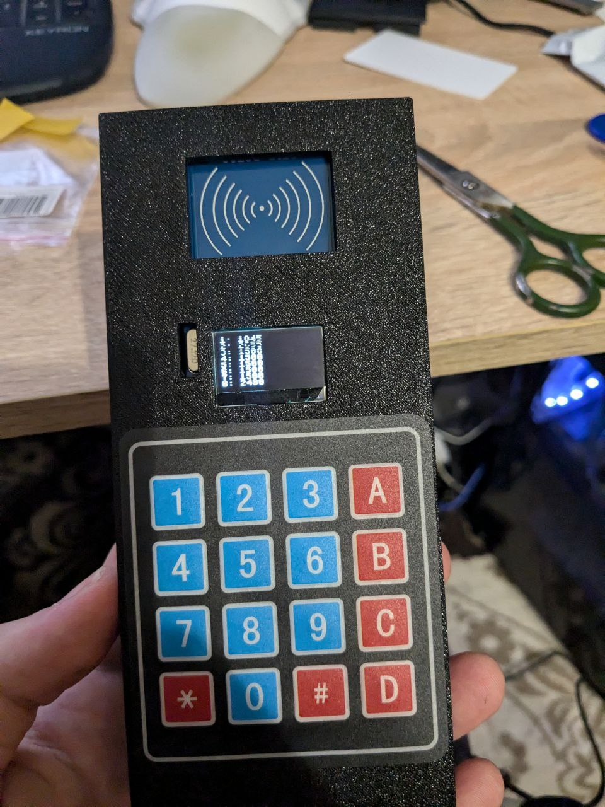

# Банк монополии

Создан для упрощения игры. Вместо подсчета, размена и передачи бумажных купюр используются карточки. Их можно прикладывать для проверки баланса. Добавлять на них деньги, уменьшать или перводить. Для вывода информации используется oled экран `0,96` дюйма `128x64`. Для чтения карточек `RFID-RC522` и для ввода матричная клавиатура 4x4.

## Детали

- RFID-модуль Arduino RC522 с картой и брелоком 
- Матричная клавиатура 4x4
- OLED дисплей 0.96" 128x64, I2C
- Контроллер RP2040 TYPE-C 16MB

## Сборка

Зажимаем клавишу boot на rp2040 и подключаем usb. В ОС появится блочное устройство. Копируем на него firmware.uf2

Для сборки проекта устанавливаем thonny Подключаем по microusb к компьютеру rp2040, при запуске зажимаем клавишу usr на 3 секунды. В системе появится девай `/dev/ttyACM0`
В thonne нажимаем Выполнить->Настроить интерпретатор. В первом выпадающем менювыбираем 'Micropython (RP2040)'. Во втором `/dev/ttyACM0`. Девайс может появиться не сразу, проверьте существование файла в системе и откройте настройку интерпретатора заново.

После этого нажмите Инструменты->Управление пакетами. В поиске пишите `micropython-ssd1306`. Установите его.

После этого создайте файлы mfrc522.py keypad.py и сохраните их на rp2040.

Создайте еще один файл main.py с соответствующим содержимым и сохраните его на rp2040.

Нажмите на зеленую кнопку и программа будет запущена

Для записи своих RFID меток в main.py self.players_rfid перечисляем значение RFID меток.
Для получения значений rfid меток добавляем print(rfid_card) после 343 строки. Прикладываем метки и смотрим в терминале значения, вписываем их в список self.players_rfid в 200 строке

## Пайка

### Матричная панель

Справа налево напрямую подключаем пины к `rp2040` в `gp2,3,8,9,10,11,12,13`

### Oled дисплей

- VCC - 3.3V

- GND - GND

- SDA - GP0

- SCL - GP1

### RFID-RC522

- 3.3V - 3.3V

- GND - GND

- RST - GP22

- SDA - GP5

- SCK - GP6

- MOSI - GP7

- MISO - GP4

## Логика банка монополии:

Возможны три действия:
  1. Получение денег от банка
  2. Передача денег банку
  3. Передача денег между игроками
  4. Сброс до 1500 всем игрокам

### Получение денег от банка:
  Нажимаем плюс, пишем сумму, нажимаем апрув, прикладываем RFID метку, происходит запись

### Передача денег банку:
  Нажимаем минус, пишем сумму, нажимаем апрув, прикладываем RFID метку, происходит запись

  Если не хватает денег, то сообщает об этом и не происходит запись
  Баланс не может быть отрицательным

### Передача денег между игроками:
  Нажимаем на кнопку передачи денег, пишем передаваемую сумму, нажимаем апрув, прикладываем от кого, прикладываем кому, нажимаем апрув

  Если деньги у игрока закончились, то отмена операции и вывести сколько не хватает

### Кнопки:
'0-9' для написания числа

'D' - Стереть символ

'A' - Принять операцию - апрув - подтверждение

'#' - Минус

'*' - Плюс

'B' - Передача денег - действие

'C' - Отмена

Для сброса всех игроков на 1500 введите обмен на 99123

### Печать

Для печати используем два файла в models. main и up stl
Включаем поддержки, 15% заполнение и печатаем

## Ссылки на источники:

_thread:
    https://www.electrosoftcloud.com/en/multithreaded-script-on-raspberry-pi-pico-and-micropython/

mfrc522-rfid:
    https://diyprojectslab.com/mfrc522-rfid-module-with-raspberry-pi-pico/

rp pico:
    https://datasheets.raspberrypi.com/pico/raspberry-pi-pico-python-sdk.pdf

micropython:
    https://github.com/micropython/micropython

ide: thonny

keypad:
    https://github.com/PerfecXX/MicroPython-SimpleKeypad

oled:
    https://habr.com/ru/companies/selectel/articles/544776/
